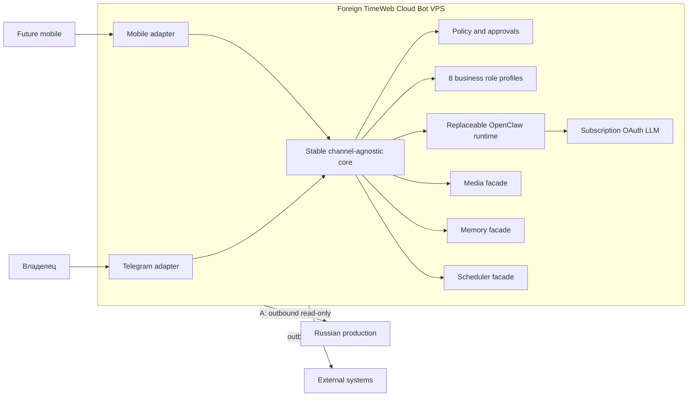

# Архитектура

## Целевая модель

Гибридная архитектура разделяет заменяемый OpenClaw runtime и стабильное channel-agnostic ядро. Ядро содержит оркестрацию ролей, policy engine, risk routing и порты; адаптеры переводят внешние протоколы в общий контракт. Никакие channel-specific типы не проходят в core или будущие skills.

Фасады media, memory и scheduler скрывают реализации. Технология очереди намеренно не выбирается до исследования требований и возможностей установленной версии OpenClaw; тяжёлые задачи не должны блокировать основной message loop.

## Границы доверия и серверов

Зарубежный VPS TimeWeb Cloud — отдельный хост помощника. Российский production-сервер не размещает помощника и не доверяет ему входящие команды. Поток A направлен только наружу от помощника к явно разрешённым наблюдаемым системам; reverse trust, общие административные учётные записи и обратные соединения запрещены.

По умолчанию компоненты слушают loopback. Межсерверный доступ требует отдельного allowlist, read-only credentials и минимального сетевого маршрута.

## Слои

1. Channel adapter: аутентификация интерфейса, нормализация сообщений, доставка уведомлений.
2. Core: intents, role selection, risk classification, approval state machine, provenance.
3. Ports/facades: LLM, media, memory, scheduler, notifications, observed systems и будущий `SensitiveDataScannerPort`.
4. Runtime adapter: заменяемая интеграция OpenClaw; все версии и поля сначала валидируются.
5. Infrastructure adapters: только после отдельного этапа Build.

## Границы этапов

- Build №1 завершён: документы, ADR и нерабочие примеры JSON.
- Build №2 завершён: TypeScript domain, ports, детерминированные policy/routing, pipeline-контракты, draft skills и автоматические проверки без внешних соединений.
- Следующий этап: локальные адаптеры и runtime policy enforcement после отдельного утверждения.
- Только после security review: sandbox/integration environment.
- Production и deployment остаются отдельным решением.

Связанные документы: [каналы](channels.md), [безопасность](security-policy.md), [deployment](deployment.md), [ADR runtime](adr/0001-openclaw-as-runtime.md).
