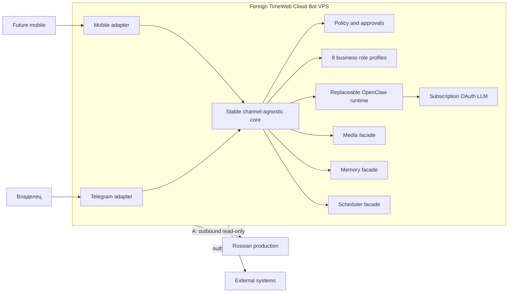

# Архитектура

## Целевая модель

Гибридная архитектура разделяет заменяемый OpenClaw runtime и стабильное channel-agnostic ядро. Ядро содержит оркестрацию ролей, policy engine, risk routing и порты; адаптеры переводят внешние протоколы в общий контракт. Никакие channel-specific типы не проходят в core или будущие skills.

Фасады media, memory и scheduler скрывают реализации. Технология очереди намеренно не выбирается до исследования требований и возможностей установленной версии OpenClaw; тяжёлые задачи не должны блокировать основной message loop.

## Границы доверия и серверов

Зарубежный VPS TimeWeb Cloud — **planned** хост помощника (не куплен, not deployed). Российский production-сервер не размещает помощника и не доверяет ему входящие команды. Поток A направлен только наружу от помощника к явно разрешённым наблюдаемым системам; reverse trust, общие административные учётные записи и обратные соединения запрещены.

По умолчанию компоненты слушают loopback. Межсерверный доступ требует отдельного allowlist, read-only credentials и минимального сетевого маршрута.

## Слои

1. Channel adapter: аутентификация интерфейса, нормализация сообщений, доставка уведомлений.
2. Core domain: типы, идентификаторы, доменные ошибки, operation context; не зависит ни от чего, кроме себя.
3. Core ports: контракты LLM, media, memory, scheduler, notifications, observed systems, approvals и `SensitiveDataScannerPort`; зависят только от domain.
4. Core policy и routing: детерминированные политики безопасности и risk routing; зависят только от domain и ports.
5. Core application: исполняемая оркестрация security-порядка, например memory-write boundary; зависит только от остальных core-слоёв.
6. App-private host (Build 3.0): локальный composition root вне core; собирает public core + ephemeral in-memory adapters; не публикуется через package exports; не создаёт trusted evidence.
7. Runtime adapter: заменяемая интеграция OpenClaw; все версии и поля сначала валидируются.
8. Infrastructure adapters: только после отдельного этапа Build.

Зависимости между слоями заданы allowlist-ом и проверяются структурным анализом AST (`npm run check:boundaries`), а не совпадением имён каталогов.

## Extension contracts

Core знает только декларативный `ExtensionManifest`, fixed security primitives и
`ExtensionRegistryPort`. Skill отвечает за capability/business analysis; channel или integration
отвечает за source authentication, protocol mapping и delivery. Ни одна сторона не наследует
полномочия другой.

Manifest не содержит code/import path и не является loader. Проверенный manifest замораживается,
затем доверенный application/deployment flow может передать его registry implementation вне core.
Фактические permissions — пересечение deployment, role, Security Guard и risk policy с deny
priority. Dynamic import из core запрещён checker независимо от target; computed
`import(expression)` / `require(expression)` также fail-closed.

Webhook contracts и VoiceProfile также provider-independent. Мужской профиль Нео не выбирает TTS
provider: если совместимого мужского голоса нет, применяется text-only, не женский fallback.

## Границы этапов

- Build №1 завершён: документы, ADR и нерабочие примеры JSON.
- Build №2 завершён: TypeScript domain, ports, детерминированные policy/routing, pipeline-контракты, draft skills и автоматические проверки без внешних соединений.
- Build 2.1A завершён: scoped/expiring/single-use approval, исполняемый memory-write boundary в `src/core/application/`, authenticated memory access context, усиленные scanner и URL policy, allowlist-based architecture checker. Это исправление Build №2, а не новый этап; adapters, providers, runtime и сеть по-прежнему отсутствуют.
- Build 2.1B добавляет только extensibility/registry/webhook/voice contracts, deterministic policies,
  отключённые example manifests и call-recording pipeline. Реального plugin loader, integration,
  webhook server, call service или TTS provider нет.
- Build 2.1C закрывает security findings OCN-001/002/003/006: approval binding к фактической
  memory operation и trusted clock, scanner newline/metadata-key policy, target-specific memory AST
  order и запрет computed module specifiers. B21-001—B21-004 намеренно не закрываются на этом этапе.
- Build 2.1D закрывает B21-001—B21-004: effective extension risk нельзя понизить runtime-параметром;
  dangerous permissions требуют matching approval effects; registry хранит activation state
  (`pending-policy` ≠ active); webhook authorization только через orchestration evidence;
  Neo VoiceProfile — только `ru-RU` masculine text-only fallback, disabled → text-only.
- Build 2.1E закрывает R2.1-003—R2.1-006: `RuntimeRiskEvidence` и `VerifiedVoiceProviderMatch`
  создаются только trusted classification/validation boundary; active registration — только после
  atomic registry transition; deployment authorization — sealed evidence, не boolean; webhook
  adapter возвращает untrusted verification result, canonical payload bytes принадлежат core,
  sealing signature evidence выполняет core. Ordinary object literals не являются trusted proof.
- Build 2.1F закрывает R2.1-001/002/007: metadata traversal budget (nodes/containers/key length/
  depth, check-before-descend); path-aware conservative memory checker (каждый write-reaching
  straight-line path; normalization и untrusted marking обязательны; ambiguous control flow →
  fail); VoiceProfile sealing через production SensitiveDataScanner. Не formal verification.
- Build 2.1G закрывает FIN-001/002/003: deeply immutable sanitized snapshot (один canonical snapshot
  для approval digest и MemoryPort); opaque `AuthenticatedMemoryAccessContext` через trusted
  `MemoryAccessGateway` (request body не назначает owner/actor/role); security evidence использует
  module-private WeakMap identity membership вместо transferable Symbol property. Package `exports`
  разрешает только root public API.
- Build 2.1H — FIN-004/005/006 **implemented, pending independent confirmation**:
  `ExtensionPermissionGateway`, `ExtensionActivationGateway` и `VoiceResolutionGateway`;
  uncertainty provider → text-only.
- Build 2.1I — FIN-007—FIN-014 **implemented, pending independent confirmation**: plain-JSON
  metadata DTO snapshot (descriptor-based; Proxy via `util.types.isProxy` only), path-valid
  approval CFG checker, webhook verifier single-read snapshot + distinct idempotency/replay
  outcomes, bounded token-family detectors, production config parsers, Node `>=22.13.0 <23`
  with documented review override, validated identity constructors, documentation truthfulness.
  FIN-012 later **CLOSED / VERIFIED** on real Node 22.13.0 (npm 10.9.2) with strict production
  gate and exact `@types/node@22.13.10` — without treating the project as production-ready.
- Build 2.1J-R4 — REV9-001: generator/async-generator executeMemoryWrite targets
  fail closed (`UNSUPPORTED_CONTROL_FLOW`) before body/stage accounting;
  **implemented, pending independent Codex Review №6**
- Build 2.1J-R3 — REV8-001/002: strict canonical AST allowlist
  (`UNSUPPORTED_CONTROL_FLOW` for labels/loops/switch/try/break/continue even without stages);
  approval-required condition AST-only (no getText security decision);
  **implemented, pending independent Codex Review №6**
- Build 2.1J-R2 — REV7-001/002/003: unreachable-after-return/throw fail-closed,
  naked approval outside gated AST sequence deny, security stages forbidden in
  expression containers; **implemented, pending independent Codex Review №6**
- Build 2.1J-R1 — CR5-001—CR5-008, REV6-001—REV6-010 и связанные
  FIN-002/004/006/008/009/011/013/014 **implemented, pending repeated independent pre-commit
  review and Codex Review №6**: recursive immutable authority/webhook snapshots, canonical
  AST-only memory-stage and approval data-flow checks, trusted-clock pre-write ordering,
  authorization-before-atomic-replay semantics, semantic exact schemas для всех status-C config
  families, scoped identity grammars и validated no-shell review runner. Это remediation Build №2,
  не начало Build №3.
- **Build 3.0 implementation revised after adversarial review; pending independent re-review and
  Codex Review №6.** App-private `src/host` local composition root (`createLocalHost`): in-memory
  ephemeral stores, deny-by-default memory policy, read/write authorization enforced through public
  `authorizeMemoryAccess`, credential-free, side-effect-free on import. Composition does not create
  built-in network clients; absolute network sandbox isolation is not enforced; injected
  dependencies remain a separate trust boundary. Trusted clock и authenticated access не inventятся
  host-ом. Telegram, OpenClaw/Codex route, OAuth, API fallback, production entrypoint и persistent
  stores отсутствуют. Package public API остаётся root-only.
- **Build 3.1 implemented; pending Codex Review №6.** Pure local config bootstrap
  (`parseLocalHostConfig` / `createLocalHostFromConfig`): explicit parsed-object envelope; four
  status-A families via existing core parsers; immutable snapshot; no file I/O, JSON text, env,
  credentials, or provider activation. Validated config is not authority evidence and does not wire
  runtime policy/routing.
- **Build 3.2 storage boundary and schema contract implemented locally, pending independent
  adversarial re-review and Codex Review №6.** App-private `parseStorageBindingRequest` /
  `createLocalStoragePlan` / `evaluateStorageSchemaCompatibility`: explicit platform + storageRoot
  only; lexical-only path validation via `node:path` (no cwd-dependent resolve, no fs probe; win32
  denies ADS colons and classic reserved device basenames); schema version compares observed values
  only to immutable `CURRENT_STORAGE_SCHEMA_VERSION` (no caller currentVersion override; with
  CURRENT=1, older valid versions do not yet exist); diagnostics report unbound backend, durability
  none, writes disabled, migrations/encryption absent. Lexical acceptance is not filesystem-open
  safety. LocalHost remains in-memory/ephemeral. Durable MemoryPort/ApprovalPort/audit,
  SQLite adapter, and core transaction gap are out of scope for 3.2.
- **Build 3.3A dependency gate:** `better-sqlite3@12.11.1` and `@types/better-sqlite3@7.6.13` are
  exact-pinned; no SQLite adapter or MemoryPort wiring yet.
- **Build 3.3B1 POSIX safe storage root implemented locally, pending adversarial review and
  Linux/Ubuntu validation.** App-private `openPosixStorageRoot` /
  `parsePosixStorageRootPolicy`: verifies an already-existing Linux directory against an explicit
  policy (UID, mode mask, repository-root containment), walks symlink components via injected/
  production system adapter, opens a directory handle for lifecycle, and returns honest
  filesystem-probed diagnostics. Does **not** open SQLite, create a database, enable writes, make
  memory durable, acquire an exclusive multi-process lock (`storageLock: none`), eliminate TOCTOU,
  or resist a privileged local attacker. Not validated yet in an Ubuntu 24.04 container. Not a
  deployment approval. Target planned host remains Timeweb Cloud VPS (4 vCPU / 8 ГБ / 80 ГБ NVMe),
  Ubuntu 24.04, Linux server-only; Windows is development-only. LocalHost stays in-memory.
  Post-open validation failures close the handle once; if close fails, the result is
  `STORAGE_ROOT_CLOSE_FAILED` with required `pendingCleanup.retryClose` (caller-owned retry,
  idempotent after success). Pre-transfer dual failure before opaque-handle creation uses the same
  explicit cleanup lifecycle — ordinary IO failure is never returned while an fd remains open
  without ownership. Not a storage lock and not second-instance protection.
- **Build 3.3B2A bounded MemoryQuery contract (prerequisite for SQLite MemoryPort):**
  `MemoryQueryRequest.limit` is required (`MEMORY_QUERY_LIMIT_MIN=1` …
  `MEMORY_QUERY_LIMIT_MAX=100`); no default, no silent clamp/coercion. In-memory MemoryPort applies
  the ceiling; SQLite MemoryPort must match. `query` string remains ignored (not content
  search). No offset/cursor/pagination. LocalHost remains in-memory; Linux container validation
  and Codex Review №6 remain pending.
- **Build 3.3B2B Safe-Root Capability Seal (prerequisite for SQLite adapter):** a successful
  `OpenedPosixStorageRoot` is now a runtime-authenticated capability via module-private WeakMap
  identity (not object shape, freeze, clone, Proxy, JSON, brand strings/symbols, or TypeScript
  types). Structural forgery cannot obtain the trusted storage root path. Capability remains
  resolvable only while the root lifecycle is `open`; `root.close` with zero child leases
  permanently retires it (failed close does not reactivate; successful close → `closed`). With
  active same-process SQLite adapter leases, `root.close` returns busy and leaves the capability
  fully open (Build 3.3B3A). Not a secret, credential, filesystem lock, exclusive lock, or
  cross-process mutex — while open, multiple low-level adapters may share one genuine root, each
  with an independent lease. Full path acquisition is available through the app-private resolve
  facade (exact SQLite factory). Child lease acquisition is available through the app-private
  lease facade consumed by the exact SQLite factory and the exact process-lock factory (not
  exported from host/storage barrels or package root). The lease itself is not a process lock.
- **Build 3.3B2 SQLite MemoryPort adapter implemented locally, pending adversarial review.**
  App-private `createSqliteMemoryPort(openedRoot)` opens compile-time `neo-memory.sqlite` as an
  immediate child of a genuine open B1 capability path (lease-aware acquisition; no raw
  path/filename/env/cwd). Schema v1 bootstrap for empty DB; verify-only reopen; no destructive
  migration. Pragmas: foreign_keys ON, busy_timeout bounded, journal_mode WAL, synchronous NORMAL,
  trusted_schema OFF when supported; startup `quick_check`. MemoryPort parity with in-memory for
  auth/limit/order/isolation; UNIQUE(owner_id, namespace, record_id) — owner is part of storage
  identity for both in-memory and SQLite adapters; ordinal-preserving overwrite within that
  identity. Explicit adapter close lifecycle (`open` → `close-pending` → `closed`). Diagnostics
  claim sqlite-local memory durability only — `localHostWired=false`, approval/audit not durable,
  no cross-port atomicity, no encryption, no exclusive lock, no second-instance protection,
  `storageRootLeaseCoordinated=true` (same-process only), Linux container unvalidated,
  deploymentReady=false. LocalHost remains in-memory and unwired. Codex Review №6 and
  VPS/deployment remain pending.
- **Build 3.3B3A Root/Adapter Lease Coordination implemented locally, pending adversarial review.**
  Module-private active lease tracking on genuine open POSIX roots; SQLite factory acquires a child
  lease before opening the DB and releases only after successful `database.close()`. `root.close()`
  is atomically busy (`STORAGE_ROOT_CLOSE_BUSY`) while any lease is held — no capability retire, no
  directory-handle close, no pendingCleanup. Failed adapter/bootstrap close retains the lease;
  pendingCleanup retry success releases it. Not a process lock, flock, PID file, or second-instance
  guard; multiple same-process adapters remain allowed. LocalHost unwired.
- **Build 3.3B3B2 / B3B3B3 / B3B4-F1 / B3B5 process-lock dependency + primitive + Linux evidence:**
  `fs-ext-extra-prebuilt@2.2.10` exact-pinned (Linux dependency gate complete). App-private
  `acquirePosixProcessLock` acquires exclusive nonblocking flock on compile-time `neo.primary.lock`
  inside a genuine open root after child lease acquisition; release is close-fd only; placeholder is
  never unlinked for stale recovery. Open flags are `O_RDWR|O_CREAT|O_NOFOLLOW` mode `0600` only —
  Node v22.13.0 does not export caller-visible `fs.constants.O_CLOEXEC`; Linux libuv sets CLOEXEC
  atomically inside `open` as implementation evidence. Production verifies actual `FD_CLOEXEC`
  fail-closed via native `fcntlSync(fd, "getfd")` after open (Candidate C / Build 3.3B3B4-F1
  committed); no production `setfd`; no magic numeric `O_CLOEXEC`. Original B3B4 Linux gate FAILED;
  runtime research probe passed; full repeated B3B4 then PASSED
  (`BUILD_3_3B3B4_LINUX_PRIMITIVE_GATE_PASSED`) on Ubuntu 24.04.4 LTS / linux-amd64 / glibc 2.39 /
  Docker overlayfs / Node v22.13.0 (default production acquire, getfd/FD_CLOEXEC, same/separate-process
  contention, normal + SIGKILL release, unsafe-file rejection, redaction, no unlink/stale deletion).
  Build 3.3B3B5 records `linuxIntegrationValidatedForPrimitive=true` as pinned-target disposable-gate
  evidence only — not a claim that the current filesystem is production-supported, not NFS/CIFS
  (`distributedFilesystemSupported=false`), not LocalHost/Neo wiring, not systemd, not deployment
  readiness. Diagnostics also keep `processLockWiredToNeo=false` /
  `secondInstanceProtectionActiveForNeo=false` / `localHostWired=false` / `deploymentReady=false` /
  `systemdLayerConfigured=false`. Process lock does not participate in Neo startup lifecycle.
  Advisory only — non-cooperating processes can bypass; no privileged-attacker / path-replacement
  resistance.
- Сервер не куплен. Deployment не разрешён.
- Реальный authentication/provider adapter и persistent atomic replay/idempotency store не
  реализованы. Окончательный security approval отсутствует pending Codex Review №6.
- LocalHost SQLite/process-lock wiring, Neo second-instance protection activation, durable
  approval/audit, secret-provider, cross-port transaction gap, systemd layer, и VPS/deployment
  остаются pending.
- Только после security review: sandbox/integration environment.
- Production и deployment остаются отдельным решением.

Связанные документы: [расширяемость](extensibility.md), [интеграции](integrations.md),
[VoiceProfile](voice-profile.md), [каналы](channels.md), [безопасность](security-policy.md),
[deployment](deployment.md), [ADR runtime](adr/0001-openclaw-as-runtime.md).
